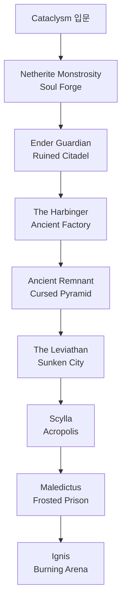

# L_Ender's Cataclysm 개요

L_Ender's Cataclysm은 **8개의 대형 보스**와 전용 던전을 추가하는 모드입니다.
Minecraft Dungeons에서 영감을 받아 제작된 독특하고 복잡한 보스 전투 시스템을 제공합니다.

:::warning 이 모드는 진짜 어렵습니다
Cataclysm 보스들은 바닐라 보스(위더, 엔더 드래곤)보다 **압도적으로 강합니다.**
준비 없이 진입하면 순식간에 사망합니다.
Apotheosis Epic 이상 장비 + 직업 스킬 중반 해금이 최소 권장 기준입니다.
:::

---

## 전체 던전 & 보스 구성



| 보스 | 던전 | 차원 | 추천 진행 순서 |
|------|------|------|--------------|
| **Netherite Monstrosity** | Soul Forge | 네더 | 1번째 |
| **Ender Guardian** | Ruined Citadel | 엔드 | 2번째 |
| **The Harbinger** | Ancient Factory | 오버월드 (지하) | 3번째 |
| **Ancient Remnant** | Cursed Pyramid | 오버월드 (사막) | 4번째 |
| **The Leviathan** | Sunken City | 오버월드 (해저) | 5번째 |
| **Scylla** | Acropolis | 오버월드 | 6번째 |
| **Maledictus** | Frosted Prison | 오버월드 (설원) | 7번째 |
| **Ignis** | Burning Arena | 네더 | 8번째 (최종) |

---

## 던전 찾는 방법

### Cataclysm 전용 Eye 아이템 사용

Cataclysm 던전은 Explorer's Compass 기준으로 안내하지 않습니다.
각 던전마다 전용 Eye 아이템이 있으며, 엔더의 눈처럼 사용하면 해당 구조물 방향을 알려줍니다.

| 던전 | 차원/지역 | 찾는 아이템 | 주요 보스 |
|------|-----------|-------------|-----------|
| **Soul Forge** | 네더, Basalt Deltas 제외 | Eye of Monstrous | Netherite Monstrosity |
| **Ruined Citadel** | 엔드 Highlands/Midlands | Eye of Void | Ender Guardian |
| **Ancient Factory** | 오버월드 지하 동굴 | Eye of Mech | The Harbinger |
| **Cursed Pyramid** | 오버월드 Desert | Eye of Desert | Ancient Remnant |
| **Sunken City** | 오버월드 Deep Ocean | Eye of Abyss | The Leviathan |
| **Acropolis** | 오버월드 Warm Ocean | Eye of Storm | Scylla |
| **Frosted Prison** | 오버월드 Snowy Plains | Eye of Curse | Maledictus |
| **Burning Arena** | 네더 Wastes | Eye of Flame | Ignis |

:::tip 사용 방식
Eye 아이템은 손에 들고 우클릭하거나 던져서 방향을 확인합니다.
정확한 조합법은 모드팩 설정에 따라 달라질 수 있으므로 JEI에서 아이템 이름을 검색해 확인하세요.
:::

### /locate 명령어

```
/locate structure cataclysm:<구조물 ID>
```

구조물 ID는 버전별로 조금 다를 수 있습니다.
명령어 자동완성에서 `cataclysm:`을 입력한 뒤 목록을 확인하는 방식이 가장 안전합니다.

---

## 전투 전 필수 준비

### 장비 기준

| 진행 단계 | 최소 장비 |
|-----------|-----------|
| 초반 보스 (Monstrosity, Ender Guardian) | Apotheosis Rare 풀세트 |
| 중반 보스 (Harbinger, Remnant, Leviathan) | Apotheosis Epic 풀세트 |
| 후반 보스 (Scylla, Maledictus, Ignis) | Apotheosis Epic + Cataclysm 장비 혼합 |

### 공통 준비물

```
[ ] 회복 포션 10개 이상
[ ] 내화 포션 (네더 보스 필수)
[ ] 수중 호흡 포션 (Leviathan 필수)
[ ] 속도 포션 (기동성 확보)
[ ] 충분한 음식
[ ] 가장 강한 무기 (특수 인챈트 포함)
[ ] 방패 (일부 보스 원거리 공격 차단)
[ ] Waystones 귀환 포인트 설정
```

---

## 보스 공통 메커니즘

### 보스 소환 방법

각 보스는 소환 방법이 다릅니다.

| 방법 | 해당 보스 |
|------|-----------|
| **접근 시 자동 깨어남** | Ender Guardian, Maledictus |
| **특정 아이템 사용** | Ancient Remnant (Desert Necklace), Harbinger (Nether Star) |
| **재료를 제단에 배치** | Ignis (Burning Ashes), Leviathan (Abyssal Sacrifice) |
| **접근 시 자동 활성화** | Netherite Monstrosity, Scylla |

### 보스 아이템 드롭 특징

- 보스 드롭 아이템은 **발광 효과**로 표시됩니다 (바닥에서 빛남)
- **오래 지속**되어 사라지지 않습니다
- 전용 음악 디스크는 **10% 확률** 드롭 (로딩 인챈트로 확률 증가)

---

## Mechanical Fusion Anvil (기계 융합 모루)

보스 아이템을 **조합해 더 강한 아이템을 만드는** 특수 제작대입니다.

```
제작 필요 소재:
  Witherite Ingot × 6 (Witherite Block 분해)
  + Redstone Block × 2
  + 일반 모루 × 1

주요 조합:
  Gauntlet of Guard + Bulwark of the Flame = Gauntlet of Bulwark
  Infernal Forge + Void Core = Void Forge
  Ignitium Chestplate + Elytra = Ignitium Elytra Chestplate
  Wither Assault Shoulder Weapon + Void Core = Void Assault Shoulder Weapon
```

:::tip Mechanical Fusion Anvil 제작 시점
The Harbinger를 처치하면 Witherite Block을 얻을 수 있습니다.
이 블록을 Witherite Ingot으로 분해해 Mechanical Fusion Anvil을 제작하세요.
이후 모든 보스 아이템 조합이 가능해집니다.
:::
