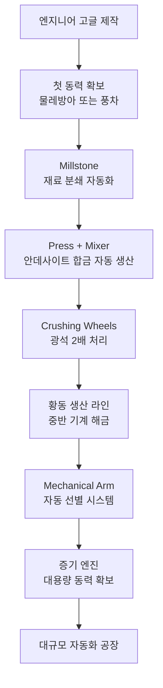

# Create 개요

Create는 **회전력(Rotational Force)** 을 동력원으로 삼는 자동화 모드입니다.  
전기나 RF 에너지 없이, 톱니바퀴와 축, 물레방아와 풍차로 공장을 돌립니다.

:::tip Create가 다른 기술 모드와 다른 점
Mekanism이나 AE2는 에너지 시스템을 먼저 이해해야 하지만,  
Create는 **눈으로 직접 보이는 물리적 동작** 이 모든 것의 기반입니다.  
돌아가는 톱니바퀴가 기계를 움직이고, 벨트가 아이템을 옮기는 것을 직접 볼 수 있습니다.
:::

---

## 핵심 개념 세 가지

### 1. RPM (분당 회전수)

모든 기계는 **회전 속도(RPM)** 로 작동 속도가 결정됩니다.

- RPM이 높을수록 기계가 빠르게 작동합니다
- 기본 최대 속도는 **256 RPM** — 초과하면 부품이 파손됩니다
- 톱니바퀴 조합으로 속도를 올리거나 낮출 수 있습니다
- Rotation Speed Controller로 정밀하게 속도를 지정할 수 있습니다 (중반 이후)

### 2. SU (스트레스 유닛)

기계를 돌리는 데 필요한 **에너지 부하**입니다.

| 상태 | 결과 |
|------|------|
| 공급 SU > 소비 SU | 정상 작동 |
| 공급 SU < 소비 SU | 과부하(Overstress), 전체 네트워크 정지 |

발전기는 SU를 공급하고, 기계는 SU를 소비합니다.

- RPM이 높아질수록 같은 기계도 SU 소비량이 증가합니다
- 네트워크가 멈추면 발전기를 추가하거나 RPM을 낮추세요

### 3. 회전 방향

모든 회전에는 **시계 방향 / 반시계 방향** 이 있습니다.

- 서로 다른 방향의 네트워크를 직접 연결하면 연결 부품이 파손됩니다
- 방향을 반전시키려면 **Gearbox(기어박스)** 를 사용하세요

---

## 인게임 학습 도구 — Ponder

Create의 가장 강력한 기능입니다.

### 사용 방법

```
아무 Create 아이템에 마우스 올리기 + W 키
→ 해당 블록의 사용법을 3D 애니메이션으로 직접 보여줍니다
```

### Ponder Index

게임 일시정지 화면 → **고글 아이콘** 클릭  
→ 모든 Create 블록의 Ponder를 한 번에 목록으로 확인 가능

:::info Create 학습 기본 순서
JEI로 조합법 확인 → W키로 Ponder 확인 → 직접 만들어보기
:::

---

## 소재 진행 단계

| 단계 | 핵심 소재 | 해금되는 것 |
|------|-----------|-------------|
| **초반** | 안데사이트 합금 | 기본 기계, 첫 자동화 루프 |
| **중반** | 황동 (Brass) | 필터, 선별, Mechanical Arm, 기차 |
| **후반** | 강화된 빛 (Refined Radiance) | 증기 엔진, 최고 효율 공장 |

---

## 전체 진행 로드맵


