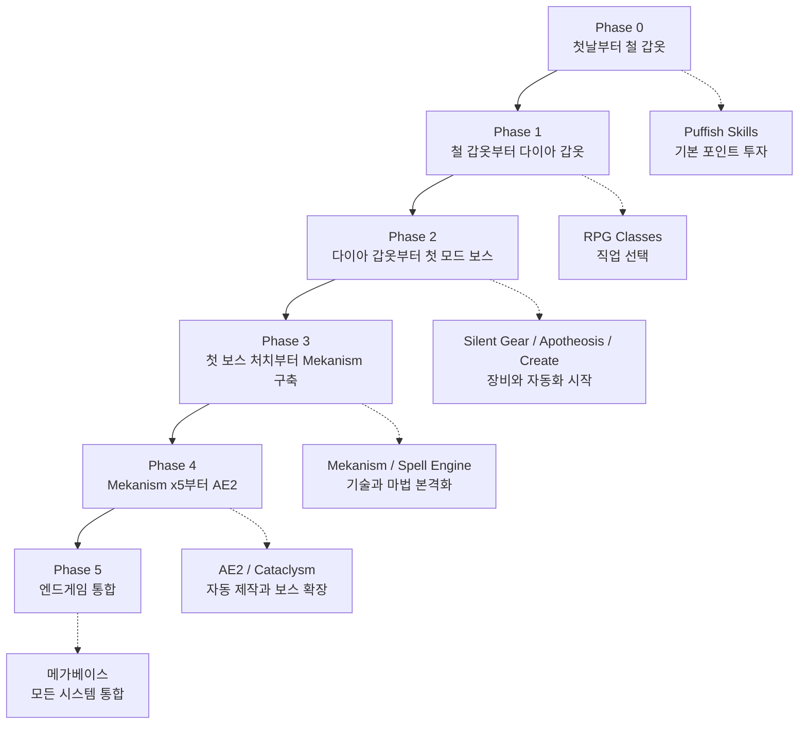
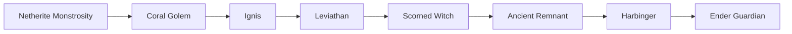

# 9단계 — 엔드게임 로드맵

> 여기까지 왔으면 진짜 고수입니다! 🎉  
> 이 모드팩에서 할 수 있는 모든 최종 목표를 한눈에 정리했습니다.

---

## 모드 도입 타이밍 — 언제 무엇을 시작해야 하나요?

> 처음부터 모든 모드를 한 번에 진행하면 복잡해집니다.  
> 바닐라 진행 단계에 맞춰서 **자연스럽게** 모드를 하나씩 시작하세요!



```
[Phase 0] 첫날 \~ 철 갑옷
  → Puffish Skills: Controls에서 skill/puffish 검색 후 스킬 포인트 투자 시작
  → Silent's Gems: 광석이 나오면 캐서 보관만 하기
  → Apotheosis Affix 아이템: 몬스터에서 드롭되면 그냥 착용
  → 나머지 모드: 구경만 하기. 고난이도 던전은 아직 들어가지 않기

[Phase 1] 철 갑옷 완성 \~ 다이아 갑옷
  ⭐ RPG Classes: 다이아 갑옷 맞추면 직업 선택 (Controls에서 class/rpg 검색)
  ⭐ Puffish Skills: 전투 트리 집중 투자
  → Spell Engine: 던전 탐험하다 스크롤 주우면 써보세요
  → When Dungeons Arise: 다이아 갑옷 완성 후 소형 구조물부터

[Phase 2] 다이아 갑옷 \~ 첫 번째 모드 보스
  ⭐⭐ Silent Gear: 다이아 20개 이상 모이면 커스텀 장비 시작
  ⭐⭐ Apotheosis: 인챈트 테이블 익숙해지면 고급 인챈트 시작
  ⭐⭐ Create: 철 64개 이상 쌓이면 자동화 시작
  → IDAS 중형 던전, Cataclysm 첫 보스 도전

[Phase 3] 첫 보스 처치 \~ Mekanism 구축
  ⭐⭐⭐ Mekanism: Create 익숙해지면 오스뮴 캐서 시작
  → Spell Engine 본격화 (스크롤 5개 이상 모이면)
  → Relics/Artifacts 액세서리 수집

[Phase 4] Mekanism x5 \~ AE2
  ⭐⭐⭐ AE2: Mekanism 에너지 인프라 갖춰지면 시작
  → Advanced Netherite + Runes
  → Cataclysm 나머지 보스 전부 도전

[Phase 5] 엔드게임
  → 모든 시스템 통합, 메가베이스 완성
```

---

## 전체 성장 타임라인

### 🌱 초반 (게임 시작 \~ 1주일)

**목표: 생존 기반 구축**

```
1일차:
  ✓ 첫날밤 생존
  ✓ 나무 → 돌 도구 제작
  ✓ 기초 은신처 구축

2\~3일차:
  ✓ 철 갑옷 & 철 도구 완성
  ✓ 침대 제작 (스폰 포인트 설정)
  ✓ 안전한 집 완성 (조명, 문)
  ✓ 농장 시작 (밀 or 동물)

4\~5일차:
  ✓ 지하 탐험 시작 (Y=-57 다이아 채굴)
  ✓ 인챈트 테이블 + 책장 15개 구축
  ✓ 다이아몬드 장비 세트 완성

6\~7일차:
  ✓ RPG Classes 직업 선택
  ✓ Puffish Skills 스킬 트리 투자 시작
  ✓ 마법 스크롤 첫 수집
```

---

### ⚔️ 초중반 (1\~2주)

**목표: 전투력 강화 & 탐험 확대**

```
  ✓ 다이아 갑옷에 주요 인챈트 완성
    (보호 IV, 수리, 내구성 III)
  ✓ 다이아 검에 날카로움 V + 수리 완성
  ✓ When Dungeons Arise 소형 구조물 클리어 시작
  ✓ IDAS 초반 던전 탐험
  ✓ Apotheosis Affix 아이템 수집 시작
  ✓ Create 모드 시작 (풍차 + 기본 자동화)
  ✓ 불사의 토템 획득 (삼림 대저택)
  ✓ 네더 탐험 → 블레이즈 막대, 네더 사마귀 수집
```

---

### 🏰 중반 (2\~4주)

**목표: 전문화 & 모드 시스템 입문**

```
  ✓ Silent Gear 커스텀 장비 첫 제작
  ✓ Spell Engine 마법 3개 이상 습득
  ✓ Puffish Skills 전투 트리 50% 이상 투자
  ✓ RPG Classes 전직 (2\~3티어)
  ✓ Cataclysm 첫 보스 도전
    → Netherite Monstrosity 처치
  ✓ Mekanism 시작 → x2 광석 처리 라인
  ✓ 엔더 드래곤 처치 (바닐라 최종)
  ✓ 위더 소환 & 처치 → 비콘 설치
```

---

### 💎 중후반 (1\~2달)

**목표: 강력한 빌드 완성 & 고난이도 도전**

```
  ✓ Silent Gear 최고 등급 장비 풀세트
  ✓ Apotheosis Mythic 등급 Affix 아이템 수집
  ✓ Cataclysm 보스 5개 이상 처치
  ✓ Mekanism x5 광석 처리 라인 완성
  ✓ AE2 ME 네트워크 첫 구축
  ✓ Puffish Skills 트리 80% 이상 완성
  ✓ IDAS 중급\~고급 던전 클리어
  ✓ Apotheosis 세계 티어 4 이상 달성
```

---

### 🌟 엔드게임 (2달 이상)

**목표: 모든 콘텐츠 완주**

```
  ✓ Cataclysm 8보스 전부 처치
  ✓ Mekanism 퀀텀 갑옷 완성
  ✓ AE2 완전 자동 제작 시스템 완성
  ✓ Apotheosis 세계 티어 최대 달성
  ✓ RPG Classes 최종 전직 완성
  ✓ Puffish Skills 모든 트리 완성
  ✓ 메가베이스 완성 (모든 모드 통합)
```

---

## 보스 처치 권장 순서

### 📋 바닐라 보스


| 순서 | 보스 | 위치 | 권장 장비 | 보상 |
|------|------|------|-----------|------|
| 1 | 엘더 가디언 | 해저 신전 | 다이아 갑옷 | 마이닝 피로 해제, 해면 블록 |
| 2 | 위더 | 직접 소환 | 인챈트 다이아 | 네더별, 비콘 |
| 3 | 엔더 드래곤 | 엔드 차원 | 최강 다이아 | 엔드 포탈 활성화, 경험치 대량 |

**위더 소환:**
```
영혼 모래 or 영혼 흙 4개 (T자 배치)
위더 스켈레톤 두개골 3개 (위에 놓기)
→ 즉시 소환!
⚠️ 지하나 격리된 공간에서 소환 추천 (폭발로 건물 파괴)
```

---

### 👹 Cataclysm 보스 (난이도 순)



| 순서 | 보스 | 특징 | 권장 장비 | 보상 |
|------|------|------|-----------|------|
| 1 | **Netherite Monstrosity** | 네더라이트 거인, 근거리 돌격 | 다이아 풀세트 | 네더라이트 재료, 특수 아이템 |
| 2 | **Coral Golem** | 바다 테마, 독 공격 | 인챈트 다이아 | 산호 재료, 마법 아이템 |
| 3 | **Ignis** | 불꽃 거인, 화염 광역 | 화염 보호 갑옷 | 화염 관련 재료 |
| 4 | **Leviathan** | 거대 바다 괴물 | 수중 호흡 + 강한 갑옷 | 심해 특수 아이템 |
| 5 | **Scorned Witch** | 마법 공격, 디버프 | 상태이상 저항 | 마법 재료, 주문서 |
| 6 | **Ancient Remnant** | 사막 보스, 모래 폭풍 | Silent Gear 장비 | 고대 재료 |
| 7 | **Harbinger** | 광역 공격, 순간이동 | Apotheosis 장비 | 강력한 무기 재료 |
| 8 | **Ender Guardian** | 최종 보스, 다단계 공격 | 최상급 장비 모두 | 최종 보상 아이템 |

**공통 보스전 팁:**
```
보스전 가기 전 체크리스트:
  □ 황금 사과 or 인챈트 황금 사과
  □ 힘 물약 II (8분)
  □ 속도 물약 II
  □ 재생 물약 II
  □ 치유 물약 4\~8개
  □ 최고 음식 (황금 당근 or 익힌 소고기 64개)
  □ 불사의 토템 (오프핸드)
  □ 여분 장비 (죽을 경우 대비)
```

---

## 장비 최종 단계

### 최종 목표 장비 세트

**근거리 전사 빌드:**
```
머리:  Silent Gear 다이아+특수광석 투구 + 보호IV/수리/내구성III
흉갑:  Silent Gear 최상급 흉갑 + 보호IV/가시III/수리
레깅스: Silent Gear + 보호IV/수리
부츠:  Silent Gear + 비단발걸음IV/보호IV/수리
무기:  Silent Gear 검 + 날카로움V/약탈III/수리/화염II
방패:  네더라이트 방패 + 내구성III
```

**마법사 빌드:**
```
머리:  수중호흡/야시경 인챈트 투구
흉갑:  보호IV/수리 흉갑
나머지: 기동성 위주
무기:  주문서 (모든 마법 등록)
보조:  마나 회복 액세서리
```

**기술자 빌드 (Mekanism):**
```
퀀텀 갑옷 풀세트 (에너지 충전식)
→ 태양광 패널 달린 투구 = 낮에 자동 에너지 충전
→ 제트팩 기능 포함 (비행 가능)
→ 거의 무적 수준의 방어
```

---

## 멀티플레이 역할 분담

플레이어분들이랑 같이 하면 역할을 나누는 게 훨씬 효율적입니다!

### 추천 역할 분담 (4\~6인 기준)

| 역할 | 담당 | 추천 직업 |
|------|------|-----------|
| 🛡️ **탱커** | 최전선 몬스터 유인, 보스 도발 | Berserker / Warrior |
| ⚔️ **딜러** | 높은 데미지, 빠른 처치 | Rogue / Witcher |
| 💚 **힐러** | 아군 체력 관리, 부활 | Priest / Paladin |
| 🔥 **마법사** | 원거리 광역 마법 딜 | Wizard (Spell Engine) |
| ⚙️ **엔지니어** | 기지 자동화, 자원 공급 | 기술 특화 (Create/Mekanism) |
| 🗺️ **탐험가** | 구조물 탐험, 희귀 아이템 수집 | 이동 특화 |

**역할별 장점:**
```
탱커: 보스전에서 적의 어그로를 담당, 힐러와 시너지 최고
딜러: 빠른 처치로 전투 시간 단축
힐러: 아군 생존율 대폭 향상
마법사: 광역 전투에서 압도적, 대형 던전 클리어 필수
엔지니어: 전체 팀에 자원 공급, 기지 수준이 팀 성장 속도를 결정
탐험가: 새로운 아이템과 정보 수집, 팀 발전 방향 제시
```

---

## 모든 모드 가이드 링크

막히는 게 있으면 각 모드 전용 가이드를 확인하세요!

### 전투/장비

| 모드 | 링크 | 핵심 내용 |
|------|------|----------|
| Apotheosis | [가이드 →](../../apotheosis/01-overview.md) | 인챈트 강화, Affix 아이템, 세계 티어 |
| RPG Classes | [가이드 →](../../classes/01-class-overview.md) | 직업 선택, 전직, 직업별 스킬 |
| Silent Gear | [가이드 →](../../silent-gear/01-overview.md) | 커스텀 장비 제작, 재료 특성 |
| Cataclysm | [가이드 →](../../cataclysm/01-overview.md) | 8보스 공략, 드롭 아이템 |
| 종합 장비 가이드 | [가이드 →](../../guide-recommended/01-archers-armory-arsenal.md) | Relics, Artifacts, Advanced Netherite |

### 마법/스킬

| 모드 | 링크 | 핵심 내용 |
|------|------|----------|
| Spell Engine | [가이드 →](../../spell-engine/01-overview.md) | 마법 습득, 원소 조합, 주문 목록 |
| Puffish Skills | [가이드 →](../../skill-system/01-overview.md) | 스킬 트리, 포인트 배분, 빌드 |

### 기술/자동화

| 모드 | 링크 | 핵심 내용 |
|------|------|----------|
| Create | [가이드 →](../../create/01-overview.md) | 발전기, 기계 목록, 자동화 |
| Mekanism | [가이드 →](../../mekanism/01-overview.md) | 에너지, 광석 x5, 고급 장비 |
| AE2 | [가이드 →](../../ae2/01-overview.md) | ME 네트워크, 자동 제작 |

### 탐험/구조물

| 모드 | 링크 | 핵심 내용 |
|------|------|----------|
| IDAS | [가이드 →](../../idas/01-overview.md) | 던전 목록, 보스, 보상 |
| When Dungeons Arise | [가이드 →](../../wiki-reference/01-dungeons-arise.md) | 구조물 목록, 여관 시스템 |

---

## 마지막으로

이 모드팩에는 정말 많은 콘텐츠가 있습니다. 처음엔 압도될 수 있지만, 하나씩 배워가다 보면 어느새 모든 걸 자유롭게 즐기고 있을 것입니다.

**중요한 마인드셋:**
- 🎯 **목표를 작게 잡기**: "오늘은 철 갑옷 완성"처럼 작은 목표부터
- 📖 **모르면 가이드 보기**: 막히면 해당 모드 가이드를 확인하세요
- 🤝 **플레이어와 함께**: 혼자보다 훨씬 빠르고 재미있습니다
- 😄 **즐기기**: 정해진 방법은 없습니다. 직접 재미있는 방식으로 진행해보세요!

**즐거운 모험이 되길 바랍니다. Have fun! 🎮**

---

*가이드는 계속 업데이트될 예정입니다. 새로운 내용이 추가되면 여기서 확인하세요!*
