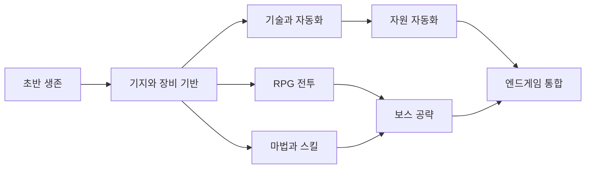
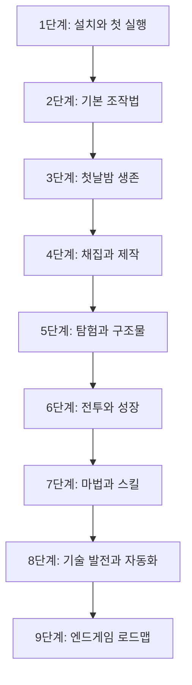

# 초보자 가이드

> **마인크래프트가 처음이거나, 모드팩이 처음인 플레이어분들을 위한 안내서입니다.**
> 이 가이드를 순서대로 따라가면 모드팩의 큰 흐름을 자연스럽게 익힐 수 있습니다.

---

## 먼저 읽어보세요 — 이 게임이 무엇인지 알아야 합니다

마인크래프트는 "**레고처럼 블록으로 이루어진 세계에서 살아남고, 탐험하고, 무언가를 만드는 게임**"입니다.

정해진 스토리나 목표가 없습니다. 무엇을 할지는 플레이어가 직접 정합니다.

처음 게임을 시작하면 아무것도 없는 들판에 혼자 서 있습니다.
나무 하나, 돌 하나부터 시작해서 집을 짓고, 무기를 만들고, 지하를 파고, 보스를 잡는 방식으로 진행합니다.

---

## 이 모드팩은 어떤 게임인가요?

**LYGR 모드팩**은 기본 마인크래프트(바닐라)에 **178개의 모드**를 추가한 버전입니다.

기본 마인크래프트가 "심심한 샌드박스"라면,
이 모드팩은 **RPG + 마법 + 공학이 합쳐진 거대한 어드벤처 게임**입니다.

### 바닐라 마인크래프트 vs 이 모드팩

| 항목 | 바닐라 마인크래프트 | 이 모드팩 |
|------|------------------|-----------|
| 보스 | 3개 (드래곤, 위더, 엘더 가디언) | 20개 이상 |
| 장비 | 나무\~네더라이트 6단계 | 수백 가지 커스텀 장비 |
| 마법 | 인챈트만 | 60개 이상의 마법 주문 |
| 자동화 | 레드스톤만 | Create, Mekanism, AE2 |
| 직업 | 없음 | 여러 RPG 직업 + 세부 전직 |
| 스킬 트리 | 없음 | RPG식 스킬 포인트 시스템 |
| 구조물 | 20여 가지 | 100가지 이상 |

### 이 모드팩의 세 가지 큰 방향

이 모드팩은 크게 세 가지 방향으로 즐길 수 있습니다.
하나만 집중해도 되고, 다 같이 해도 됩니다.

#### 방향 1: RPG 전투
몬스터를 잡고, 장비를 강화하고, 강력한 보스에 도전하는 방향입니다.

- **RPG Classes** — 전사, 마법사, 도적, 궁수 등 다양한 직업 선택
- **Apotheosis** — 인챈트 강화, 특수 능력 아이템
- **Cataclysm** — 8개의 거대 보스와 전투
- **Silent Gear** — 재료를 조합한 커스텀 무기/갑옷

#### 방향 2: 마법
마법 주문을 배우고, 원소를 조합해서 강력한 마법사가 되는 방향입니다.

- **Spell Engine** — 60가지 이상의 마법 주문
- **Puffish Skills** — RPG식 스킬 트리로 마법 능력치 강화
- **Artifacts / Relics** — 특수 능력이 달린 장신구 수집

#### 방향 3: 기술 & 자동화
기계를 만들고, 공장을 구축하고, 모든 걸 자동화하는 방향입니다.

- **Create** — 기어와 벨트로 작동하는 물리 기반 기계
- **Mekanism** — 산업용 기계로 자원을 5배로 처리
- **Applied Energistics 2** — 디지털 창고 & 자동 제작

---

## 이 가이드를 어떻게 읽어야 하나요?

**바닐라(기본 게임) 설명 → 자연스럽게 모드 연결** 구조로 구성했습니다.

처음에는 모드를 신경 쓰지 말고 바닐라 내용만 따라가세요.
각 단계 끝에 **"이제 이 모드 사용해보세요!"** 코너가 나오면 그때 모드를 조금씩 시작합니다.

> **팁:** 막히는 단계가 있으면 그 단계 가이드를 다시 읽어보세요.
> 모르는 부분이 생기면 각 모드 전용 가이드도 함께 참고하세요.

---

## 자주 묻는 질문 (FAQ)

**Q. 마인크래프트를 한 번도 해본 적 없어도 괜찮을까요?**
A. 괜찮습니다. 이 가이드가 조작법부터 전부 알려드립니다.

**Q. 모드가 너무 많아서 무엇을 해야 할지 모르겠습니다.**
A. 처음엔 모드를 신경 쓰지 않아도 됩니다. 바닐라 내용만 따라가다 보면 자연스럽게 모드가 등장합니다.

**Q. 혼자 해도 재미있나요?**
A. 재미있습니다. 다만 플레이어분들이랑 같이 하면 훨씬 재미있습니다. 역할 분담이 가능하기 때문입니다.

**Q. 게임이 너무 어렵습니다.**
A. 세계 만들 때 난이도를 **평화로움**으로 설정하면 몬스터가 안 나옵니다. 바닐라에 익숙해지면 그때 올려보세요.

**Q. 죽으면 어떻게 되나요?**
A. 아이템을 다 떨어뜨리고 스폰 포인트로 돌아옵니다. 빨리 가서 줍지 않으면 5분 후에 사라집니다. 그래서 좋은 아이템은 집에 놓고 다니는 습관이 중요합니다.

---

## 지금 바로 시작해보세요

[1단계: 설치 & 첫 실행 →](/docs/user-guide/beginners-guide/first-launch)
